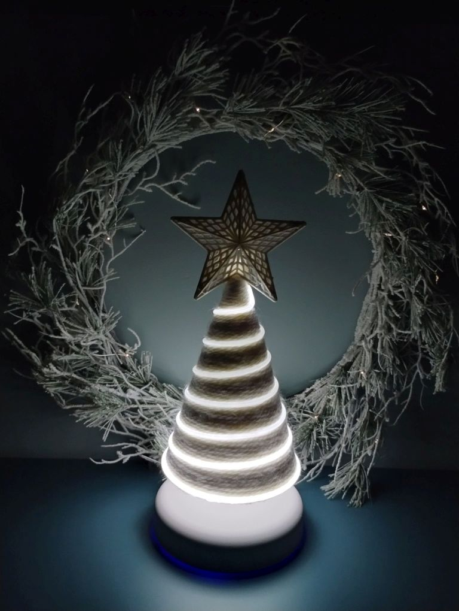

# Christmas tree lamp
> Christmas tree lamp prepared for a child's school Christmas market.

## Table of contents
* [General info](#general-info)
* [Topology](#topology)
* [Technologies](#technologies)
* [PCB](#pcb)
* [Setup](#setup)
* [Main components selection](#main-components-selection)
* [Status](#status)
* [License](#license)

## General info
Luminous Christmas tree-shaped light controlled by touch/proximity. The lamp uses a side-lit fiber optic as the luminous element. The light source is an LED module in white color. LED modules in red, green, blue are also available. Changing the LED module will require setting a different supply voltage on the DC/DC inverter and current verification. The lamp is powered by a battery. The capacity of the battery is sufficient to power the lamp through the night. The battery is charged via a USB type C port. The maximum total current of charging and lighting does not exceed 1 A. When the battery is charging, the D2 LED is lit, which produces a blue glow under the base of the lamp. The skeleton of the lamp and the embedding of the side-lighting fiber on it is a matter of individual taste. This is the most difficult part of the project and its execution directly affects the final result. I built the skeleton from stiff cardboard reinforced with wikol glue and wrapped the skeleton with white yarn. I mounted the LED module on plastic flat bars and glued them with hot glue to the inner parts of the skeleton.

## Topology

## Technologies
* Main luminous technology: Mentor M-FIBRE
* KiCAD as an EDA

## PCB

## Setup
Battery charging from USB type C socket with 500mA current set with PROG resistor R2 of 2k.
Sensor touch/proximity sensitivity adjustable with capacitor C7.

## Main components selection
* LED module
  Mentor 1330.0002; White; 1W; 3,3V; 150mA; Imax=300mA;
* Side-lit fiber
  Mentor 1330.1006; 1,5 m; white
* Battery
  Batimex LP505060; Li-Po; 3,7V; 2000mAh. The battery has built in overcharging, overdischarging and over current protection mechnisms.
  Dimensions: length：50mm Max, width： 60,5mm Max, thickness: 5mm Max
* DC/DC converter
  MCP1601-I/MS; Input voltage 2,7-5,5V; Output voltage 0,8-5V. Chip is not needed but good to have as an additional protection for expensive LED module.
  One mode of operation (LDO mode) occurs when the input voltage approaches the output voltage and the BUCK duty cycle approaches 100%. The MCP1601 will enter a low drop out mode and the high-side P-Channel BUCK switch will saturate, providing the output with the maximum voltage possible. 
* LED driver
  MIC4801YM; SO8; 600mA; 0÷5,5V; Ch: 1; 3÷5,5VDC; It features a typical dropout of 50mV at 150mA, LED voltage: 0-Vin
* Touch sensor
  AT42QT1012; One-channel Toggle-mode QTouch® Touch Sensor IC with Power Management Functions
* Battery charger
  MCP73831T-2ACI/OT; Supply voltage: 3,75 - 6V; 4,2V output voltage model; Programmable charge current: 15mA - 500mA;  

## Status
Project is: _finished_.

## License
This project is licensed under the MIT License - see the LICENSE file for details

